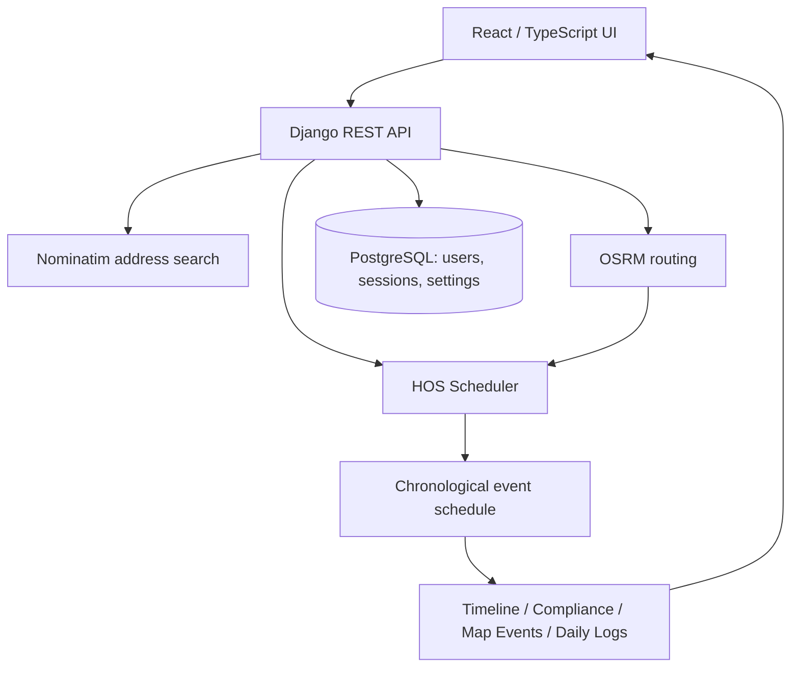

# RouteLog HOS

Full-stack driver trip planner and Hours-of-Service scheduling demo built with Django, React, TypeScript, PostgreSQL, OpenStreetMap, Nominatim, and OSRM.

## Overview

RouteLog HOS converts **Current Location → Pickup Location → Drop-off Location**, together with **Current 70-hour Cycle Used**, into a real road route and an HOS schedule under defined planning assumptions. Results include distance and driving time, pickup/drop-off service, required breaks and rest, fuel planning, a compliance summary, an interactive map, a chronological timeline, and multi-day driver daily logs.

Built for a Full Stack Developer hiring assessment, the project demonstrates how geospatial data and business rules can produce a consistent, reviewable trip plan.

This is a planning application and assessment demo, **not a certified Electronic Logging Device (ELD)**. Generated logs remain **Planned Log — Driver Certification Required**.

## Key Features

### Real Route Planning

- OSRM routes preserve Current → Pickup → Drop-off order and return real road geometry, distance, and estimated driving time.
- React Leaflet displays the route on OpenStreetMap with chronological route markers and stop details.
- Explicit Nominatim address searches support Enter or the search icon; typing does not trigger autocomplete requests.

### Hours-of-Service Planning

Assessment planning rules for a property-carrying driver include:

- 11-hour driving limit and 14-hour driving window.
- A qualifying 30-minute non-driving break before exceeding eight cumulative driving hours.
- 10-hour qualifying rest.
- A 70-hour / 8-day cycle model with a 34-hour restart when required.
- One hour each for pickup and drop-off service.

The compliance summary checks the calculated schedule against these implemented rules; it does not certify regulatory compliance.

### Fuel & Rest Scheduling

- Fuel is scheduled before additional travel beyond a 1,000-mile interval.
- Each fuel stop is a 30-minute On Duty event that consumes cycle time.
- A qualifying fuel stop can satisfy the break rule when applicable, avoiding an unnecessary duplicate break.
- Fuel, breaks, rest, and restart events appear consistently on the map, timeline, and logs.

### Multi-Day Driver Logs

- Dynamic Day 1 / Day 2 / Day 3+ tabs follow the trip duration.
- Each daily log includes a 24-hour duty graph, quarter-hour grid, daily mileage, timed remarks, and carrier/driver/vehicle/shipping metadata.
- Duty totals account for **24.00 hours** per calendar day.
- A print-friendly full log presents trip details, duty status, remarks, and a **Driver Certification Required** section. No signature or certification is generated automatically.

### Authentication & Settings

- Django session authentication with CSRF protection.
- Persistent administrator profile and workspace branding/settings.
- Password changes through Django's validation and hashing.
- Validated logo upload, replacement, and reset.

## Architecture



One chronological backend event schedule drives compliance, the timeline, map markers, mileage allocation, daily duty graphs, and remarks. These views share the same event data rather than calculating independent schedules. PostgreSQL persists users, sessions, and workspace settings; trip plans are calculated on request.

## Technology Stack

| Layer | Technologies |
|---|---|
| Frontend | React 19, TypeScript, Vite, React Leaflet, Leaflet, Framer Motion, Lucide |
| Backend | Python 3.12, Django 5.2, Django REST Framework, Django Sessions / CSRF, Gunicorn, WhiteNoise |
| Data | PostgreSQL in production; SQLite for local development |
| Geospatial APIs | OSRM, Nominatim, OpenStreetMap |

No Google Maps or paid mapping API is required.

## Project Structure

```text
routelog-hos/
├── backend/
│   ├── accounts/          # Authentication, profile, and branding
│   ├── config/            # Django configuration
│   ├── core/              # Health endpoint and shared middleware
│   └── trips/services/    # Routing, HOS, geometry, and daily-log logic
├── frontend/
│   ├── src/components/    # Planner, map, timeline, and daily-log UI
│   ├── src/services/      # API requests and backend data normalization
│   └── scripts/           # Frontend service regression checks
├── docs/
├── render.yaml
└── README.md
```

## Local Setup

Requirements: **Python 3.12+** and **Node.js 20+**. Run the following commands from the project root.

### Backend

```sh
cd backend
python3.12 -m venv .venv
source .venv/bin/activate
python -m pip install -r requirements-lock.txt
cp .env.example .env
python -c 'import secrets; print(secrets.token_urlsafe(50))'
```

Set the generated value as `DJANGO_SECRET_KEY` in `backend/.env`. Keep `DJANGO_DEBUG=true` and leave `DATABASE_URL` empty to use SQLite locally.

```sh
python manage.py migrate
python manage.py create_demo_user
python manage.py runserver
```

Create the demo user through `python manage.py create_demo_user`, which prompts for credentials privately and preserves an existing account. Sign in using the credentials you choose.

Health endpoint: [http://localhost:8000/api/health/](http://localhost:8000/api/health/).

### Frontend

In a second terminal, from the project root:

```sh
cd frontend
npm ci
cp .env.example .env.local
npm run dev
```

Open [http://localhost:5173](http://localhost:5173). The local frontend API base is `http://localhost:8000/api`. Use localhost consistently for both services and restart them after changing environment files.

## Testing & Validation

**139 backend tests passing**, covering authentication, settings, input validation, routing adapters, scheduling, fuel events, geometry, and daily logs. External services are mocked in automated tests.

```sh
cd backend
source .venv/bin/activate
python manage.py check
python manage.py makemigrations --check
python manage.py test
```

Frontend validation:

```sh
cd frontend
npm run typecheck
npm run build
node scripts/verify-trips.mjs
node scripts/verify-workspace.mjs
```

Frontend checks cover API data normalization, location and route validation, event/log consistency, session handling, and CSRF behavior. Browser checks cover trip planning, dynamic log tabs, full-log presentation, and responsive layouts at 1440, 1024, 768, and 390 pixels.

## Planning Assumptions

- A deterministic integer-second scheduler uses a fixed planning clock; browser timezone conversion does not change the displayed schedule.
- The driver is assumed to have completed a qualifying rest before departure. Input cycle usage represents aggregate hours already consumed.
- Pickup and drop-off each consume one hour On Duty. Driving and On Duty events consume cycle capacity; qualifying rest and restart are Off Duty.
- Daily logs split events at midnight and fill unoccupied time with Off Duty so every log accounts for 24 hours.
- Stop positions are approximate route-progress positions interpolated along OSRM geometry. Whole-second scheduling may place fuel slightly before its distance boundary.

## Scope & Limitations

The application is a trip-planning demonstration, not a certified ELD. It includes no legal driver-signature workflow, FMCSA filing, or ELD hardware integration.

The scheduler implements the stated assessment rules without split-sleeper optimization or adverse-condition exceptions. Historical rolling eight-day recapture is excluded because the assessment input supplies aggregate cycle usage rather than a duty-history ledger.

OSRM driving estimates do not include truck-specific routing restrictions, traffic, or weather. Fuel/rest coordinates are approximate planning positions, not verified facilities or safe parking locations. Public mapping services are suitable for demonstration use; sustained multi-user usage requires appropriate provider capacity and shared request limiting.

Uploaded logos require durable media storage for long-term production persistence. Render's default filesystem is ephemeral, so demo uploads may disappear after redeployment.

## Security

- Django session authentication with HttpOnly session cookies and Secure cookies in production.
- CSRF validation on mutations, exact trusted origins, and no wildcard CORS.
- Password validation and hashing through Django; credentials are not stored in frontend browser storage.
- API responses marked private/no-store.
- Secrets belong in environment variables. `.gitignore` excludes local environment files, databases, and uploads; no secrets are committed to the repository.

## Deployment

The demo architecture uses a Vercel React frontend, a Render Django API, and Render PostgreSQL, with OSRM/Nominatim/OpenStreetMap providing routing, address search, and map data:

**Browser → React frontend → Django API → PostgreSQL**, with geospatial service calls handled by Django and map tiles displayed by Leaflet.

Vercel proxies `/api/*` and `/media/*` to Render, allowing the frontend to use a relative `/api` base for session and CSRF requests. Production configuration requires PostgreSQL, HTTPS, secure cookies, and explicit host/origin allowlists. Gunicorn serves Django, WhiteNoise serves collected static files, and migrations run separately from web startup.

Environment examples and deployment configuration are included in the project. Live Demo and Loom Walkthrough links can be added once available.

## Engineering Highlights

- Full-stack architecture with clear API and UI responsibilities.
- Complex business rules implemented through deterministic scheduling and independently checked event sequences.
- Geospatial API integration and route-progress interpolation.
- Django API development and a typed React interface with responsive map, timeline, and duty-graph visualizations.
- Session security, persistent settings, automated regression coverage, and deployment configuration.

## License

Released under the MIT License.
